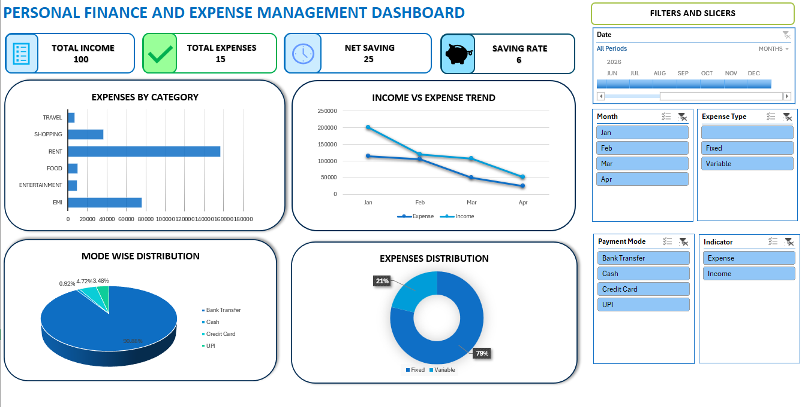

# Personal-Finance-Expense-Management-Dashboard-Excel
An end-to-end Excel-based Personal Finance &amp; Expense Management System featuring KPI analytics, budget tracking, and interactive dashboard visualization for real-world financial decision-making.
# 💰 Personal Finance & Expense Management System (Advanced Excel Project)

## 📊 Project Overview
The Personal Finance & Expense Management System** is an Advanced Excel-based analytical project designed to simulate real-world financial tracking and decision-making.  
It helps individuals understand their income, expenses, savings, and budgeting behavior using structured data analysis and interactive dashboards.

This project replicates how financial analysts and wealth managers monitor personal financial health using data-driven insights.

## 🎯 Objective
The main objective of this project is to:
- Track income and expenses efficiently
- Analyze spending behavior across categories
- Evaluate budget vs actual spending
- Measure savings performance
- Build an interactive financial dashboard using Excel

## 🛠️ Tools & Technologies Used
- Microsoft Excel (Advanced Level)
- Pivot Tables
- SUMIFS, IF, COUNTIFS, XLOOKUP
- Data Cleaning Techniques
- Data Visualization (Charts & KPI Cards)
- Conditional Formatting

## 📁 Dataset Description
The dataset includes realistic personal financial transactions with the following fields:
- Date
- Month
- Income Source
- Expense Category
- Expense Type (Fixed / Variable)
- Payment Mode (Cash, UPI, Card, Bank Transfer)
- Amount
- Income/Expense Indicator
- Budget Allocated
- Actual Expense
- Budget Remaining
- Notes

## 📊 Key Features of the Project
- Clean and structured financial dataset
- Monthly expense tracking system
- Budget vs Actual performance analysis
- Expense categorization (Fixed vs Variable)
- Payment mode analysis
- Automated KPI calculations
- Interactive dashboard with visual insights

---

## 📌 Key KPIs Developed
- Total Income
- Total Expenses
- Net Savings
- Savings Rate %
- Budget Utilization %
- Category-wise Expense Analysis
- Top Spending Categories
- Transaction Volume Analysis

📈 Dashboard Preview

> The dashboard provides a visual summary of income, expenses, savings, and category-wise spending patterns using charts, KPI cards, and filters.

📊 Business Insights Derived
- Identification of major expense categories
- Understanding overspending areas
- Monitoring savings performance
- Evaluating financial discipline
- Supporting better budgeting decisions

🧠 Learning Outcomes
This project helped strengthen:
- Advanced Excel skills
- Financial analysis thinking
- Data cleaning and structuring
- Dashboard design principles
- Real-world budgeting logic

🚀 Conclusion
This project demonstrates how raw financial data can be transformed into meaningful insights using Excel.  
It showcases strong analytical thinking, data handling skills, and dashboard development capability.
